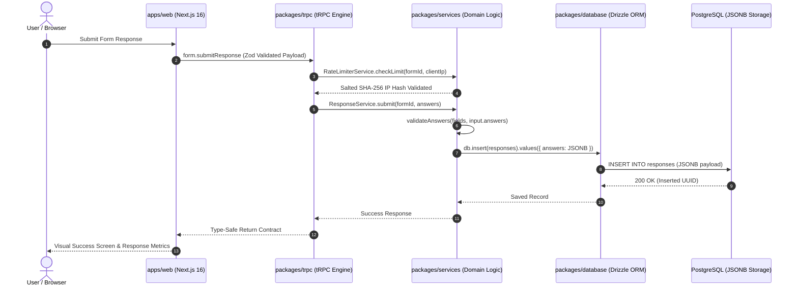

# 🎯 Zenith Form — Typeform-Style Form Builder SaaS

[](https://nextjs.org/)
[](https://react.dev/)
[](https://www.typescriptlang.org/)
[](https://pnpm.io/)
[](https://turbo.build/)
[](https://www.postgresql.org/)

> A **production-inspired Turborepo monorepo** built with Next.js 16, Express, tRPC, Zod, and Drizzle ORM. Designed to demonstrate full-stack architecture, shared package contracts, database design with PostgreSQL JSONB, and clean authorization patterns.

---

## 🌐 Live Demo & Documentation

* **🌐 Live Web Application**: [https://zenith-form-web.vercel.app/](https://zenith-form-web.vercel.app/)
* **⚡ Production API Server**: [https://zenith-form.onrender.com/](https://zenith-form.onrender.com/)
* **📖 Interactive API Documentation**: [https://zenith-form.onrender.com/docs](https://zenith-form.onrender.com/docs)

---

## 🔑 Key Features

1. **Authentication & Guest Access**
   * Google OAuth 2.0 flow with JWT session management.
   * Instant Guest Demo Login with unique per-session isolation requiring no OAuth setup.

2. **Form & Field Engine**
   * Create, edit, publish, unpublish, and delete forms with live preview canvas.
   * Supports **10 dynamic field types**: `short_text`, `long_text`, `email`, `number`, `phone`, `single_select`, `multi_select`, `checkbox`, `rating`, `date`.

3. **Public Questionnaire & Submissions**
   * Step-by-step Typeform-style UX with progress tracking.
   * Service-validated answer constraints matching frontend rules.
   * Built-in request-window rate limiting per form/IP combination.

4. **Analytics & Data Export**
   * On-demand submission counters and per-field answer breakdowns.
   * Choice distribution percentages and rating averages.
   * One-click CSV export and JSON-compatible API response retrieval.

5. **API Documentation**
   * Automatically generated OpenAPI 3.0 specs available through the Scalar UI at `/docs`.

---

## 🏗️ System Architecture & Overview

Zenith Form uses a clean layer separation between the web frontend, Express API server, shared tRPC procedures, domain business services, and database schemas.

### Top-Level Component Diagram

```text
                    ┌─────────────────┐
                    │   Next.js Web   │
                    └────────┬────────┘
                             │
                         tRPC / Zod
                             │
                    ┌────────▼────────┐
                    │  Express API    │
                    └────────┬────────┘
                             │
                    ┌────────▼────────┐
                    │ Domain Services │
                    └───────┬─┬───────┘
                            │ │
                   ┌────────┘ └────────┐
                   ▼                   ▼
             ┌───────────┐       ┌───────────┐
             │  Drizzle  │       │   Logger  │
             └─────┬─────┘       └───────────┘
                   │
             ┌─────▼─────┐
             │ PostgreSQL │
             │   + JSONB  │
             └────────────┘
```

### End-to-End Submission Request Flow



---

## 🛠️ Tech Stack & Monorepo Structure

* **Frontend**: Next.js 16 (App Router), React 19, Tailwind CSS, `shadcn/ui`.
* **Backend API**: Express.js with `trpc-to-openapi` and `@scalar/express-api-reference`.
* **API & Data Contracts**: Strongly typed API contracts using tRPC v11 & Zod schema validation across client and server.
* **Database & ORM**: PostgreSQL with Drizzle ORM (JSONB for dynamic form schemas & flexible response storage).
* **Authentication & Sessions**: Google OAuth 2.0 + Instant Guest Demo Login using HTTP-only JWT cookies.
* **Security & Access Control**: Service-level resource ownership checks, CORS origin isolation, and privacy-conscious IP hashing.

---

## 💡 Engineering Case Study: Design Decisions & Trade-offs

### 1. PostgreSQL JSONB vs. Entity-Attribute-Value (EAV)

* **Decision**: Form questions and user response answers are stored using PostgreSQL `JSONB` columns rather than a normalized EAV structure or dynamic table DDL migrations.
* **Rationale**: EAV schemas introduce query complexity and heavy joins, while dynamic DDL migrations add runtime operational risk. `JSONB` allows atomic single-row inserts and flexible schemaless data storage for diverse question types.
* **Trade-off**: Drizzle ORM provides database type definitions, while runtime validation logic (`validateAnswers()`) at the service layer ensures submitted answers conform to the form's active field definitions.

### 2. Monorepo Shared Contracts (`packages/trpc` + Zod)

* **Decision**: API routers, procedures, and Zod schemas are centralized in shared workspace packages.
* **Rationale**: Eliminates duplication between client form inputs and server handlers. Modifying a backend Zod schema triggers compile-time TypeScript type checking across the monorepo.

### 3. Rate Limiting Strategy

* **Decision**: An in-memory fixed-window rate limiter with a 1-minute window and a 5 requests/minute limit per form/IP, combined with salted SHA-256 IP hashing.
* **Rationale**: Protects form endpoints from basic submission spam and abusive bursts without persisting raw client IP addresses.

### 4. Service-Layer Analytics

* **Decision**: Aggregations such as counts, choice option percentages, and average ratings are computed at the service layer after fetching response rows from PostgreSQL.
* **Trade-off**: Simple and efficient for the current project scope while avoiding additional database aggregation structures. Larger-scale deployments would require SQL aggregation queries or pre-aggregated rollups.

---

## 🔒 Security, Privacy & Access Control

* **Resource Ownership**: Endpoints verify form and question ownership (`form.creatorId === userId`) inside domain services before executing mutations.
* **Draft Creator Preview**: Form creators can preview `/f/[id]` in draft mode; submissions return mock IDs without polluting analytics database tables.
* **Privacy-Conscious Hashing**: Raw client IPs are combined with a process-generated salt and hashed using SHA-256 before being used for rate limiting.
* **Authentication**: Supports Google OAuth 2.0 with automatic profile creation and HTTP-only JWT session cookies.

---

## ☁️ Production Deployment

Zenith Form is deployed across the following cloud infrastructure:

* **Web Frontend**: Hosted on **Vercel** (`apps/web`) with automatic deployments from GitHub.
* **Backend API**: Hosted on **Render** (`apps/api`) as a Node.js web service.
* **Database**: Hosted on **Supabase** (PostgreSQL 16) utilizing JSONB columns.
* **Database Schema & Migrations**: Managed via **Drizzle ORM** with versioned migration files in `packages/database/drizzle`.

---

## 📁 Repository Structure

```text
zenith-form/
├── apps/
│   ├── api/             # Express API server (tRPC + Scalar OpenAPI 3.0 docs)
│   └── web/             # Next.js 16 App Router web application
├── packages/
│   ├── database/        # Drizzle ORM schemas, PostgreSQL connection & migrations
│   ├── logger/           # Shared logging utility
│   ├── services/         # Decoupled domain services (Form, Field, Response, User, RateLimiter)
│   └── trpc/             # Shared tRPC routers, Zod validation schemas & proxies
└── docker-compose.yml    # Local PostgreSQL database container
```

---

## 🚀 Quickstart & Local Setup

### 1. Prerequisites

* Node.js >= 18
* pnpm 9+
* Docker Desktop (for PostgreSQL container)

### 2. Setup Environment Variables

Copy `.env.example` to `.env` in the root:

```bash
cp .env.example .env
```

### 3. Start Database

```bash
docker-compose up -d
```

### 4. Install Dependencies

```bash
pnpm install
```

### 5. Apply Database Migrations

```bash
pnpm db:migrate
```

### 6. Start Local Development

```bash
pnpm dev
```

* **Web App**: `http://localhost:3000`
* **API Server**: `http://localhost:8000`
* **Scalar API Docs**: `http://localhost:8000/docs`

---

## 🧪 Quality Assurance

Enforce codebase consistency and type checking across all monorepo packages:

```bash
# Check TypeScript types across web, api, and shared packages
pnpm check-types

# Run ESLint rules
pnpm lint
```

---

## ⚠️ Known Limitations & Scaling Roadmap

As a project designed for architectural demonstration and evaluation, specific design choices were tailored for demo/development environments:

1. **Distributed Rate Limiting**: The current rate limiter uses an in-memory `Map` with process-scoped storage and a server-restart IP salt.
   **Production Path:** Move to Redis with TTL-based key expiration and a persistent salt stored in secrets management.

2. **Database-Level Analytics Aggregation**: Response metrics are calculated in application memory.
   **Production Path:** Push aggregations to PostgreSQL (`COUNT`, `AVG`, `JSONB_AGG`) or build materialized views.

3. **Advanced Form Features**: Advanced features such as conditional branching logic, form expiration timers, and webhook dispatchers (Slack/Discord) are documented for future iterations.

---

## 📄 License

MIT License
